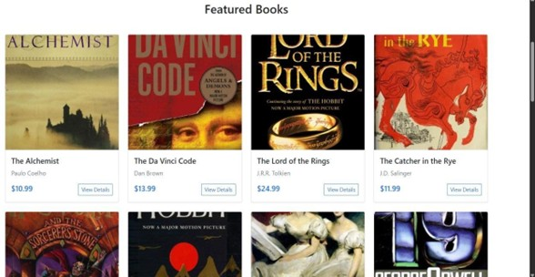
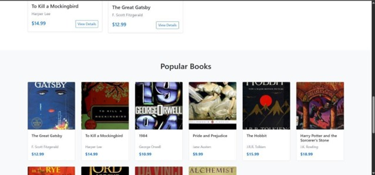

# 📚 Virtual Bookstore - E-commerce Web Application


## 📖 Introduction

**The Virtual Bookstore** is a full-featured e-commerce web application developed using the Spring framework. Traditional bookstores face limitations in accessibility and inventory. This project addresses those needs by creating a user-friendly virtual platform that provides both a wide selection and a curated, engaging shopping experience.

The goal is to provide a seamless digital space for users to explore, search, select, and purchase books securely.

## 📸 Screenshots

### 1. Home Page
*The landing page featuring the hero section and featured books.*


### 2. Book Catalog & Search
*Users can search for books by title, author, or genre.*




## 🚀 Features

* **User Management**: Secure registration (with hashed passwords) and authentication using Spring Security.
* **Book Catalog**: Public browsing of book listings with cover images, descriptions, and pricing.
* **Advanced Search**: Filter books by title, author, or genre.
* **Shopping Cart**: Dynamic cart management allowing users to add items, update quantities, and view real-time totals.
* **Checkout Process**: A streamlined checkout simulation for confirming orders.
* **Recommendation System**: Suggests books based on genre preferences and popularity.
* **Reviews & Ratings**: Users can leave ratings and textual reviews for books.

## 🛠️ Tech Stack

| Category | Technology |
| :--- | :--- |
| **Backend** | Spring Boot 3  |
| **Web Framework** | Spring Web (MVC)  |
| **Security** | Spring Security  |
| **Database** | H2 (Dev) / PostgreSQL (Prod)|
| **ORM** | Spring Data JPA |
| **Frontend** | Thymeleaf Template Engine  |
| **Build Tool** | Maven  |

## 🏗️ System Architecture

The application follows a maintainable **n-tier architecture**:
1.  **Controller Layer:** Handles HTTP requests and maps to views (e.g., `BookController`, `HomeController`).
2.  **Service Layer:** Contains business logic and transaction management (e.g., `BookService`, `CartService`).
3.  **Repository Layer:** Manages data persistence via Spring Data JPA interfaces.

### Database Entities
* **User:** Credentials and role management.
* **Book:** Inventory details (ISBN, price, stock).
* **Order:** Transaction records and status.
* **Review:** User feedback and ratings.

## 📸 Screenshots

### 1. Home Page
*Featuring a hero section and featured books.*

[cite_start]*(Place your screenshot of the Welcome page here)* [cite: 1911]

### 2. Book Catalog & Search
*Search functionality filtering by genre (e.g., Fiction).*

[cite_start]*(Place your screenshot of the search results here)* [cite: 2029]

### 3. Book Details
*Detailed view with "Add to Cart" functionality and stock status.*

[cite_start]*(Place your screenshot of The Hobbit/Harry Potter details here)* [cite: 2041]

### 4. User Authentication
*Secure Login and Registration forms.*

[cite_start]*(Place your screenshot of the Login/Register forms here)* [cite: 2077]

## ⚙️ Installation & Usage

1.  **Clone the repository:**
    ```bash
    git clone [https://github.com/jasmine1711/Virtual_Bookstore.git](https://github.com/jasmine1711/Virtual_Bookstore.git)
    ```

2.  [cite_start]**Navigate to the project directory:** [cite: 1905]
    ```bash
    cd virtual-bookstore
    ```

3.  [cite_start]**Build and Run:** [cite: 1909]
    ```bash
    mvn clean spring-boot:run
    ```

4.  **Access the Application:**
    Open your web browser and go to:
    [cite_start]`http://localhost:8086` [cite: 1895]


---
## 📄 License
Distributed under the MIT License. See LICENSE for more information.

Developed with ❤️ by Tanushree Nayal

---

*© 2024 Virtual Bookstore. All rights reserved.*
